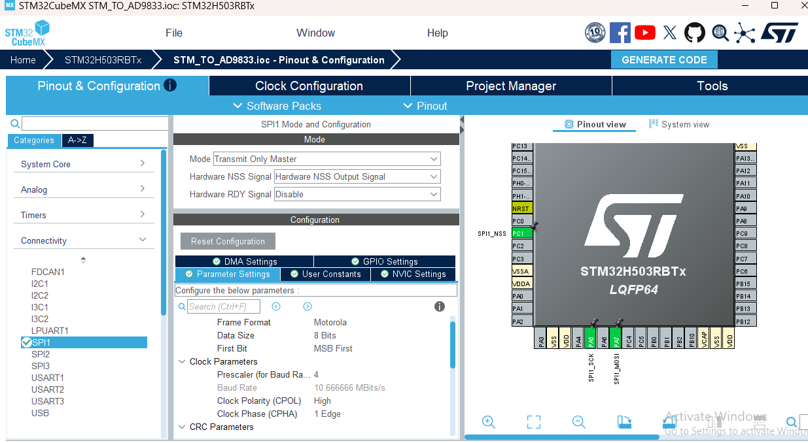
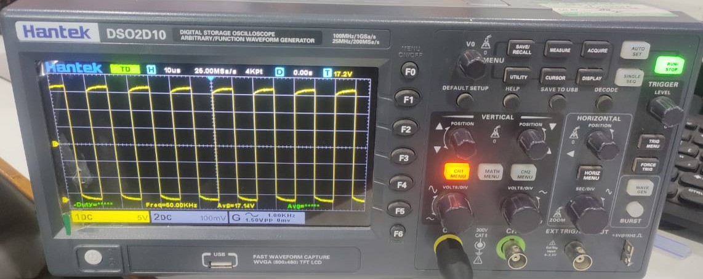
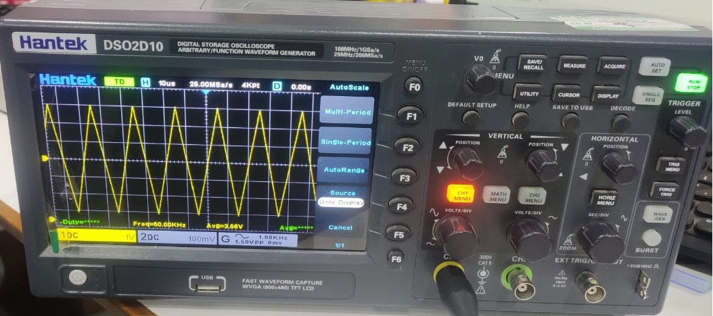

# STM32 AD9833 DDS Waveform Generator

This project demonstrates interfacing the **AD9833 Direct Digital Synthesis (DDS) IC**
with an **STM32H503RB** microcontroller using **SPI (write-only)** communication.

The project generates **sine, square, and triangle waveforms** with programmable
frequency and phase using STM32CubeMX + HAL drivers.

---

##  Hardware Used

- **Microcontroller**: STM32H503RB (Cortex-M33)
- **DDS IC**: AD9833
- **Reference Clock (FMCLK)**: 25 MHz
- **Communication Protocol**: SPI (Transmit Only)

---
##  AD9833 IC – Fundamentals

The **AD9833** is a **low power, programmable waveform generator**
capable of producing:

- Sine wave
- Triangle wave
- Square wave

### Key Features
- 28-bit frequency resolution
- Programmable phase
- SPI compatible serial interface
- On-chip DAC
- Low power operation

---

##  How AD9833 Generates Waveforms

AD9833 uses **Direct Digital Synthesis (DDS)**:

1. A **28-bit phase accumulator**
2. A **sine lookup table**
3. A **DAC** to generate analog output

Frequency is controlled using the tuning word:

Frequency = (Tuning_Word × FMCLK) / 2^28

---

##  Communication Protocol – SPI (Write-Only)

### Important Notes

- AD9833 **does NOT have a MISO pin**
- Data is **write-only**
- STM32 transmits **16-bit control words**
- Communication happens only when **FSYNC is LOW**

### SPI Signals Used

| Signal | Direction | Description |
|------|----------|------------|
| MOSI | STM32 → AD9833 | Control & data |
| SCLK | STM32 → AD9833 | SPI clock |
| FSYNC | STM32 → AD9833 | Chip select |
| MISO | ❌ Not present | Not required |

---

##  SPI Configuration (STM32CubeMX)

The SPI is configured exactly as per AD9833 requirements.

### SPI Mode
- **SPI Mode 2**
  - CPOL = 1 (Clock Idle High)
  - CPHA = 1st Edge

### SPI Parameters

| Parameter | Value |
|--------|------|
| Mode | Master (Transmit Only) |
| Data Size | 8-bit |
| First Bit | MSB First |
| Clock Polarity | High |
| Clock Phase | 1 Edge |
| NSS | Software |
| Baud Rate Prescaler | 4 |

The following image shows the **CubeMX configuration**.

---

##  Control Word Structure (16-bit)

Each SPI write consists of **16 bits**:

D15 D14 | D13 ... D0

- Upper 2 bits select register
- Remaining bits contain data

### Register Selection

| Register | Command Bits(D15|D14) |
|--------|--------------|
| Control | 00 |
| Frequency  | 01 |
| Phase  | 11 |

---

##  Supported Waveforms

| Waveform | Description |
|--------|------------|
| Sine | Default DAC output |
| Triangle | Linear ramp |
| Square | MSB of accumulator |

---

##  Example Usage 

AD9833_Init(wave_sine, 50000, 0);
Generates 50 kHz sine wave
Phase = 0°

##  Output Verification (Oscilloscope)

The following image shows the **50 kHz sine wave** generated by the AD9833,
measured using a **Hantek DSO2D10 Digital Storage Oscilloscope**.

The following image shows the **50 kHz square wave** generated by the AD9833,
measured using a **Hantek DSO2D10 Digital Storage Oscilloscope**.

The following image shows the **50 kHz triangle wave** generated by the AD9833,
measured using a **Hantek DSO2D10 Digital Storage Oscilloscope**.

#  Author

# Kunal Yadav

